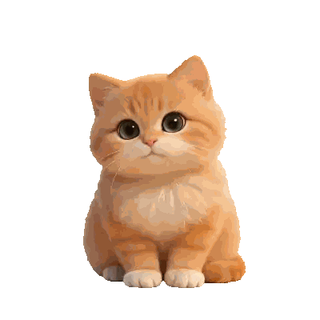

<div align="center">


# 团子

**你的 AI 编程搭子，就趴在桌面上。**

一只会根据 Claude Code 状态实时反应的桌面宠物猫。
思考时翻书、工作时敲键盘、完成时提醒你、摸它还会撒娇。

[](https://github.com/wangcong940310-dotcom/tuanzi-releases/releases/latest)
[](https://github.com/wangcong940310-dotcom/tuanzi-releases/releases/latest)

[**下载**](https://github.com/wangcong940310-dotcom/tuanzi-releases/releases/latest) · [**功能介绍**](#功能) · [**快速开始**](#快速开始) · [**反馈**](#反馈)

</div>

---

## 功能

### Claude Code 实时联动

团子通过 Webhook 监听 Claude Code 的 Hook 事件，实时切换动画状态：

| Claude 状态 | 团子反应 |
|---|---|
| 用户提交 Prompt | 翻书搜索 |
| 工具调用中 | 敲键盘工作 |
| 任务完成 | 开心提醒 + 音效 |
| 等待审批 | 弹出权限面板 |
| 会话结束 | 打瞌睡 |
| 空闲太久 | 睡着了 |

### 20+ 种动效

#### 日常
    

待机 · 伸懒腰 · 舔爪子 · 睡觉 · 喝水

#### 交互
 

戳一下 · 摸摸撒娇

#### 工作
  

搜索翻书 · 思考 · 敲键盘

#### 状态
 

完成提醒 · 消息通知

### 侧边吸附 + 终端会话面板

拖到屏幕边缘自动吸附，悬停弹出终端会话面板：

- 实时显示所有 Claude 会话状态
- 点击跳转到对应终端窗口（支持 Terminal / iTerm2 / Kitty / WezTerm / Ghostty）
- 权限审批和选项弹窗内联显示，不打断工作流
- 喝水倒计时集成在面板标题栏

### 多终端支持

| 终端 | tty 跳转 | 窗口标题匹配 |
|---|---|---|
| Terminal.app | ✅ | ✅ |
| iTerm2 | ✅ | ✅ |
| Kitty | ✅ | - |
| WezTerm | ✅ | - |
| Ghostty | - | ✅ |

### 其他功能

- **飞书消息监听** — Dock 角标变化时播放提醒动画
- **喝水提醒** — 自定义间隔，支持秒/分/时
- **权限快捷键** — 可配置修饰键 + 按键，不用鼠标点
- **进程发现** — 自动发现未通过 Hook 注册的 Claude 会话
- **拖拽 & 摸摸** — 拖着玩、来回划触发撒娇动画

---

## 快速开始

### 1. 下载安装

前往 [Releases](https://github.com/wangcong940310-dotcom/tuanzi-releases/releases/latest) 下载最新 zip，解压后拖入「应用程序」文件夹。

### 2. 配置 Claude Code Hook

首次打开团子时会自动配置。如需手动配置，在 `~/.claude/settings.json` 的 `hooks` 中添加：

```json
{
  "hooks": {
    "UserPromptSubmit": [{ "hooks": [{ "type": "command", "command": "bash ~/.clawd/hook.sh thinking" }] }],
    "PreToolUse": [{ "hooks": [{ "type": "command", "command": "bash ~/.clawd/hook.sh working" }] }],
    "Stop": [{ "hooks": [{ "type": "command", "command": "bash ~/.clawd/hook.sh attention" }] }],
    "SessionStart": [{ "hooks": [{ "type": "command", "command": "bash ~/.clawd/hook.sh idle" }] }],
    "SessionEnd": [{ "hooks": [{ "type": "command", "command": "bash ~/.clawd/hook.sh sleeping" }] }]
  }
}
```

### 3. 开始使用

启动团子 → 拖到屏幕右侧吸附 → 打开终端用 Claude Code → 团子会跟着动起来。

---

## 工作原理

```
Claude Code ──Hook事件──→ hook.sh ──HTTP──→ 团子 Webhook (port 23333)
                                                    │
                                          ┌─────────┼─────────┐
                                          ▼         ▼         ▼
                                       动画切换   会话面板   权限弹窗
```

---

## 系统要求

- macOS 13.0+
- Claude Code（配置 Hook）

---

## 反馈

遇到问题或有建议？打开团子设置 → 反馈，扫码添加飞书联系。

---

<div align="center">
<sub>用 ❤️ 和 Claude 一起做的</sub>
</div>
