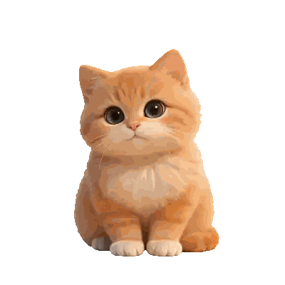
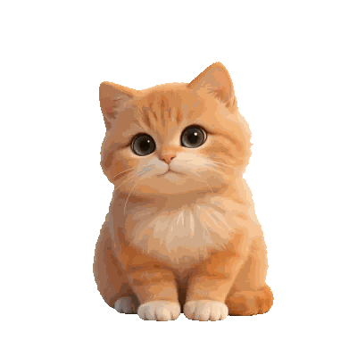
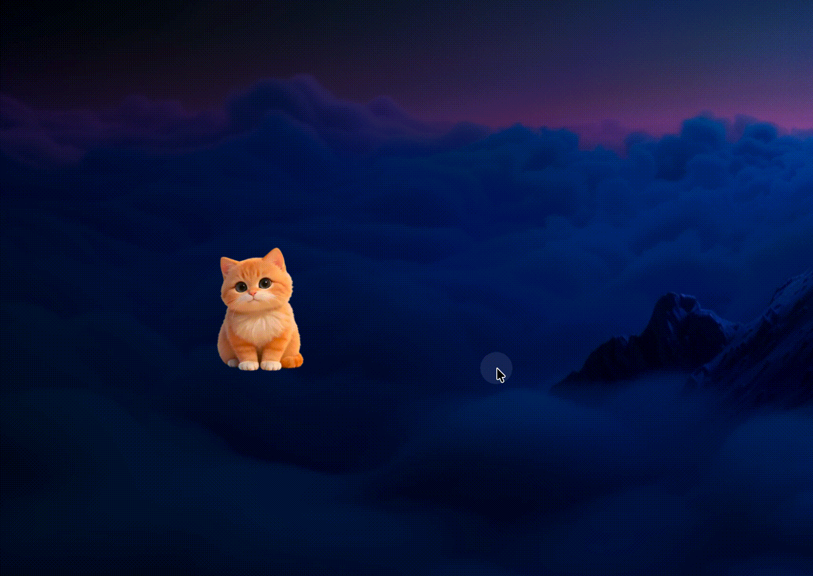

<div align="center">


# Tuanzi

**Your AI coding buddy, right on your desktop.**

A desktop pet cat that reacts in real time to Claude Code's status.
Flips through books while thinking, types while working, celebrates when done — and purrs when you pet it.

[](https://github.com/wangcong940310-dotcom/tuanzi-releases/releases/latest)
[](https://github.com/wangcong940310-dotcom/tuanzi-releases/releases/latest)

[**Download**](https://github.com/wangcong940310-dotcom/tuanzi-releases/releases/latest) · [**Features**](#features) · [**Getting Started**](#getting-started)

</div>

---

## Features

### Real-time Claude Code Integration

Tuanzi listens to Claude Code hook events via Webhook and switches animations in real time:

| Claude Status | Tuanzi Reaction |
|---|---|
| User submits prompt | Flips through books |
| Tool call in progress | Types on keyboard |
| Task complete | Happy celebration + sound |
| Waiting for approval | Permission panel pops up |
| Session ends | Dozes off |
| Idle too long | Falls asleep |

### 20+ Animations

#### Daily

| Idle | Stretch | Lick Paw | Sleep | Drink |
|:---:|:---:|:---:|:---:|:---:|
|  |  |  |  |  |

#### Interactive

| Poke | Pet | Drag | Typing |
|:---:|:---:|:---:|:---:|
|  |  |  |  |

#### Work & Status

| Search | Think | Working | Done | Notify |
|:---:|:---:|:---:|:---:|:---:|
|  |  |  |  |  |

### Edge Docking + Terminal Session Panel



Drag to the screen edge to auto-dock. Hover to reveal the terminal session panel:

- Live status of all Claude sessions
- Click to jump to the corresponding terminal window (supports Terminal / iTerm2 / Kitty / WezTerm / Ghostty)
- Inline permission approval and option prompts — no workflow interruption
- Hydration reminder countdown integrated in the panel title bar

### Multi-Terminal Support

| Terminal | tty Jump | Window Title Match |
|---|---|---|
| Terminal.app | ✅ | ✅ |
| iTerm2 | ✅ | ✅ |
| Kitty | ✅ | - |
| WezTerm | ✅ | - |
| Ghostty | - | ✅ |

### Other Features

- **Lark notification listener** — Plays alert animation on Dock badge changes
- **Hydration reminder** — Custom intervals in seconds / minutes / hours
- **Permission hotkey** — Configurable modifier + key combo, no mouse needed
- **Process discovery** — Auto-detects Claude sessions not registered via hooks
- **Drag & pet** — Drag to play, swipe back and forth to trigger purring animation

---

## Getting Started

### 1. Download & Install

Go to [Releases](https://github.com/wangcong940310-dotcom/tuanzi-releases/releases/latest), download the latest zip, unzip and drag into your Applications folder.

### 2. Configure Claude Code Hooks

Tuanzi auto-configures on first launch. For manual setup, add the following to `hooks` in `~/.claude/settings.json`:

```json
{
  "hooks": {
    "UserPromptSubmit": [{ "hooks": [{ "type": "command", "command": "bash ~/.clawd/hook.sh thinking" }] }],
    "PreToolUse": [{ "hooks": [{ "type": "command", "command": "bash ~/.clawd/hook.sh working" }] }],
    "Stop": [{ "hooks": [{ "type": "command", "command": "bash ~/.clawd/hook.sh attention" }] }],
    "SessionStart": [{ "hooks": [{ "type": "command", "command": "bash ~/.clawd/hook.sh idle" }] }],
    "SessionEnd": [{ "hooks": [{ "type": "command", "command": "bash ~/.clawd/hook.sh sleeping" }] }]
  }
}
```

### 3. Start Using

Launch Tuanzi → Drag to the right edge of the screen → Open a terminal with Claude Code → Tuanzi comes alive.

---

## How It Works

```
Claude Code ──Hook Event──→ hook.sh ──HTTP──→ Tuanzi Webhook (port 23333)
                                                    │
                                          ┌─────────┼─────────┐
                                          ▼         ▼         ▼
                                     Animations  Session   Permission
                                                  Panel     Prompt
```

---

## Requirements

- macOS 13.0+
- Claude Code (with hooks configured)

---

<div align="center">
<sub>Made with ❤️ and Claude</sub>
</div>
